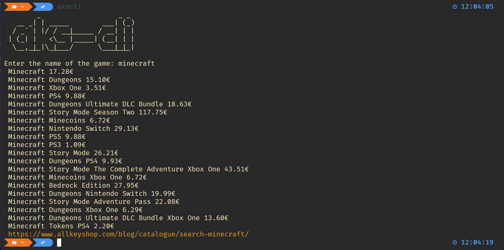

# Aks-Cli

**The (unofficial) AllKeyShop CLI from searching game directly into your terminal!!!**



# Installation
> Make sure you have the **xmllint** command 

you can copy the **akscli** script or use this one-line install

(this will download it into your /usr/local/bin)
```bash

sudo curl -sSL https://raw.githubusercontent.com/macro21KGB/akscli/main/akscli -o /usr/local/bin/akscli 
sudo chmod +x ~/.local/bin/akscli
```

# Usage

After that you can run it with:
```bash
aksli
```
or open help with -h [--help]
```bash
        _                   _ _
   __ _| | _____        ___| (_)
  / _` | |/ / __|_____ / __| | |
 | (_| |   <\__ |_____| (__| | |
  \__,_|_|\_|___/      \___|_|_|


Check the AllkeyShop Prices from your terminal (Unofficial)

Syntax: akscli [-h]
options: 
h    Print this Help.

created by macro21KGB (https://github.com/macro21KGB)
-----------------------------------------------------
```